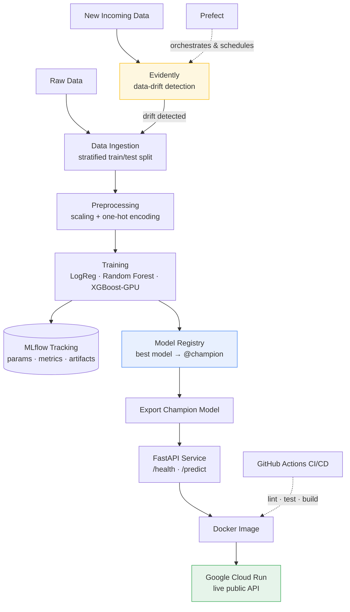

# Customer Churn Prediction — End-to-End MLOps

[](https://github.com/YOUR_USERNAME/churn-prediction-mlops/actions/workflows/ci.yml)


A **production-grade, end-to-end MLOps project** that predicts customer churn — built to demonstrate the full lifecycle of a machine learning system, not just a model in a notebook. It covers reproducible pipelines, experiment tracking, a model registry, containerized serving, CI/CD, data-drift monitoring, and automated retraining, all the way to a live cloud deployment.

> **🔴 Live demo:** [`<your-cloud-run-url>/docs`](<your-cloud-run-url>/docs) — interactive Swagger UI. Send a customer profile to `POST /predict` and get a live churn prediction.

---

## 📌 Overview

The goal of this project isn't to squeeze out the last 1% of model accuracy — it's to show how a model is **operationalized**: made reproducible, tracked, versioned, served, tested, monitored, and kept healthy in production over time. The ML itself is deliberately kept simple (a well-tuned classifier) so the focus stays on the **MLOps layer**.

**Dataset:** the [Telco Customer Churn](https://www.kaggle.com/datasets/blastchar/telco-customer-churn) dataset (7,043 customers, 21 features) — a binary classification problem with realistic class imbalance (~26.5% churn).

**Best model:** a GPU-accelerated **XGBoost** classifier (with Logistic Regression and Random Forest as compared baselines), reaching **~0.84 ROC-AUC** with high recall on churners.

---

## 🏗️ Architecture



**The self-healing loop:** Prefect runs the drift check on a schedule → if Evidently detects drift, it automatically triggers retraining → the new best model is registered as `@champion` → because serving loads the model *by alias*, the API picks up the new model with zero code changes.

---

## 🛠️ Tech Stack

| Layer | Tools |
|---|---|
| **Language & Environment** | Python 3.12, venv, pip |
| **Data & Modeling** | pandas, NumPy, scikit-learn, XGBoost (GPU) |
| **Experiment Tracking & Registry** | MLflow |
| **Serving** | FastAPI, Uvicorn, Pydantic |
| **Containerization** | Docker |
| **CI/CD** | GitHub Actions |
| **Monitoring** | Evidently (data drift) |
| **Orchestration** | Prefect |
| **Cloud** | Google Cloud Run |
| **Code Quality** | pytest, ruff |

---

## ✨ Key Features

- **Reproducible & modular pipeline** — config-driven (YAML), no hardcoded values, proper logging, clean `.py` modules instead of notebooks-in-production.
- **Experiment tracking** — every training run's parameters, metrics, and model artifact logged to MLflow and comparable side-by-side.
- **Multi-model comparison** — Logistic Regression, Random Forest, and GPU-accelerated XGBoost, with automatic selection of the best by ROC-AUC.
- **Model registry with aliases** — the winning model is versioned and promoted to `@champion`, decoupling training from serving.
- **REST API** — FastAPI service with input validation, `/health` and `/predict` endpoints, and auto-generated Swagger docs.
- **Containerized & portable** — a lean Docker image with the model baked in; runs identically anywhere.
- **CI/CD** — GitHub Actions runs linting, unit tests, a full pipeline smoke-test, and a Docker build on every push.
- **Data-drift monitoring** — Evidently compares incoming data against the training distribution and flags when retraining is needed.
- **Automated retraining** — a Prefect flow retrains and re-registers the model *only* when drift is detected.
- **Live cloud deployment** — deployed to Google Cloud Run (scales to zero, public HTTPS endpoint).

---

## 📂 Project Structure

```
churn-prediction-mlops/
├── .github/workflows/ci.yml        # CI/CD pipeline (lint, test, build)
├── configs/
│   └── config.yaml                 # single source of truth for all settings
├── notebooks/
│   └── 01_eda.ipynb                # exploratory data analysis
├── scripts/
│   ├── generate_synthetic_data.py  # synthetic data for CI
│   └── simulate_drift.py           # drift simulation for the monitoring demo
├── src/
│   ├── config.py                   # YAML config loader
│   ├── logger.py                   # logging setup (cloud-safe)
│   ├── data_ingestion.py           # load + stratified train/test split
│   ├── preprocessing.py            # cleaning + ColumnTransformer
│   ├── evaluation.py               # classification metrics
│   ├── train.py                    # multi-model training + MLflow tracking
│   ├── register_model.py           # register best model → @champion
│   ├── export_model.py             # export champion for deployment
│   ├── api.py                      # FastAPI serving app
│   ├── monitoring.py               # Evidently drift detection
│   └── pipeline.py                 # Prefect orchestration + retraining
├── tests/                          # pytest unit tests
├── Dockerfile                      # serving container
├── requirements.txt                # dev/training dependencies
├── requirements-serving.txt        # lean serving dependencies
└── README.md
```

---

## 🚀 Getting Started

### 1. Clone and set up the environment

```bash
git clone https://github.com/YOUR_USERNAME/churn-prediction-mlops.git
cd churn-prediction-mlops

python -m venv venv
# Windows:
venv\Scripts\activate
# macOS/Linux:
source venv/bin/activate

pip install -r requirements.txt
```

### 2. Get the data

Download the [Telco Customer Churn dataset](https://www.kaggle.com/datasets/blastchar/telco-customer-churn) and place the CSV at `data/raw/telco_churn.csv`.

### 3. Run the pipeline

```bash
python -m src.data_ingestion     # split into train/test
python -m src.train              # train + compare models, log to MLflow
python -m src.register_model     # register the best model as @champion
python -m src.export_model       # export the champion for serving
```

View the experiments in the MLflow UI:

```bash
mlflow ui --backend-store-uri sqlite:///mlflow.db
# open http://127.0.0.1:5000
```

### 4. Serve the API locally

```bash
uvicorn src.api:app --reload
# open http://127.0.0.1:8000/docs
```

### 5. Check for data drift

```bash
python -m src.monitoring                                  # healthy batch
python scripts/simulate_drift.py                          # create a drifted batch
python -m src.monitoring data/processed/drifted_batch.csv # → drift detected
# report saved to reports/drift_report.html
```

### 6. Orchestrate with Prefect

```bash
python -m src.pipeline    # runs drift check → retrains only if drift is found
```

### 7. Run with Docker

```bash
docker build -t churn-api .
docker run -p 8080:8080 churn-api
# open http://localhost:8080/docs
```

---

## 🔌 API Usage

**`POST /predict`** — predict churn for a single customer:

```bash
curl -X POST "<your-cloud-run-url>/predict" \
  -H "Content-Type: application/json" \
  -d '{
    "gender": "Female", "SeniorCitizen": 0, "Partner": "No", "Dependents": "No",
    "tenure": 2, "PhoneService": "Yes", "MultipleLines": "No",
    "InternetService": "Fiber optic", "OnlineSecurity": "No", "OnlineBackup": "No",
    "DeviceProtection": "No", "TechSupport": "No", "StreamingTV": "No",
    "StreamingMovies": "No", "Contract": "Month-to-month", "PaperlessBilling": "Yes",
    "PaymentMethod": "Electronic check", "MonthlyCharges": 79.85, "TotalCharges": 159.70
  }'
```

**Response:**

```json
{
  "churn": true,
  "churn_label": "Churn",
  "churn_probability": 0.83
}
```

---

## 📸 Screenshots

> _Add screenshots here to make the project pop:_
> - `docs/mlflow_ui.png` — the MLflow experiment comparison view
> - `docs/swagger.png` — the FastAPI `/docs` interface
> - `docs/drift_report.png` — the Evidently drift report

<!--  -->
<!--  -->
<!--  -->

---

## ⚙️ CI/CD

Every push to `main` triggers a GitHub Actions workflow that:

1. **Lints** the code with `ruff`
2. **Runs** the unit-test suite with `pytest`
3. **Executes** the full pipeline on synthetic data (integration smoke-test)
4. **Builds** the Docker image

A green ✓ on the commit means the whole system still works end-to-end.

---

## 📈 Key MLOps Concepts Demonstrated

- Separation of concerns (config / logic / data) and reproducible environments
- Preprocessing packaged *with* the model to prevent train/serve skew
- Fit-on-train / transform-on-test discipline (no data leakage)
- Model versioning and alias-based promotion for zero-downtime model swaps
- Graceful degradation (GPU→CPU fallback, cloud-safe logging)
- Feature-drift monitoring as an early-warning signal (no labels required)
- Conditional, automated retraining loops

---

## 📄 License

This project is licensed under the MIT License — see the [LICENSE](LICENSE) file for details.

---

<p align="center"><i>Built as an end-to-end MLOps learning project — from raw data to a live, self-monitoring production service.</i></p>
